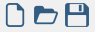
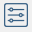
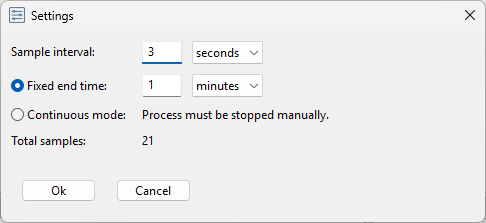

Configurations
--------------

Configurations are JSON files that contains the following items:

* Settings of the data logger
* Instruments and their settings.
* Measurments and their settings.
* Process control steps and their settings.
* Graphs and their settings.

With the following toolbar buttons the configuration can be created, opened and saved:

The first button creates a new configuration. New configurations are created with default settings:

* Sample time: 3 seconds
* End time: 1 minute
* Continuous mode: disabled

The settings can be changes with the following toolbar button:

A settings dialog will be shown:

|

In this window you can set the sample time and how the data logger must end.
The data logger can be stopped in the following ways:

* Fixed end time: the data logger is stopped whether the process or measurements are finished or not.
* Continuous mode: the data logger must be stopped manually.
* On process end: the data logger stops when the process ends, measurements are also stopped.

In continuous mode, the process can end and stop.
The measurements will continue until the data logger is stopped.
