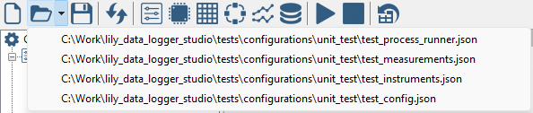

Configurations
--------------

Configurations are JSON files that contains the following items:

* Settings of the data logger
* Instruments and their settings.
* Measurments and their settings.
* Process control steps and their settings.
* Graphs and their settings.

With the following toolbar buttons the configuration can be created, opened and saved:

.. image:: images/configuration_buttons.png

The first button creates a new configuration. The second button opens an exsiting configuration.
The third button saves the current configuration. A configuration is saved in a single JSON file.
There is no limit on the size of the configuration (e.g.: number of instruments or measurements, etc.).

Next to the open configuration button is a small arrow. Clicking this arrow will show a
dropdown menu with the most recent opened configurations:

This makes it convenient to quickly open previous saved configuration.

New configurations are created with default settings:

* Sample time: 3 seconds
* End time: 1 minute
* Mode: fixed time

The settings can be changes with the following toolbar button:

.. image:: images/settings_button.png

A settings dialog will be shown:

.. image:: images/settings_window.png
    :align: center

|

In this window you can set the sample time and how the data logger must end.
The data logger can be stopped in the following ways:

* Fixed time: the data logger is stopped at the given end time,
  whether the process or measurements are finished or not.
* Process end: the data logger stops when the process ends, measurements are also stopped.
* Continuous mode: the data logger must be stopped manually.
  If a process has ended, the measurements continue.

The total samples is an indication when fixed end time is used. In the other modes,
the number of samples depends on when the data logger stops.

The lowest sample time is 1 second. This can only be achieved if all your measurements can
be done within 1 second. Measurements are handled in parallel as much as possible.
Nevertheless due to restrictions caused by the amount of measurements, the number of instruments,
PC performance, etc., a sample time of 1 second may not be feasable.
Errors will be reported when samples are outside the sample interval. When those errors are
reported try, to increase the sample interval.
