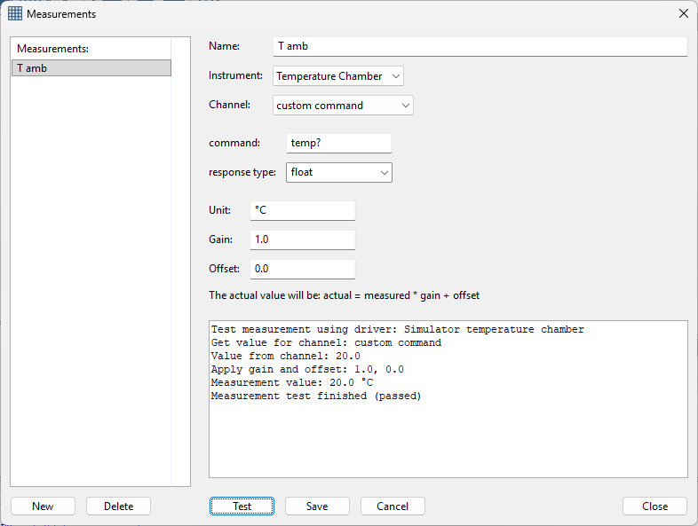
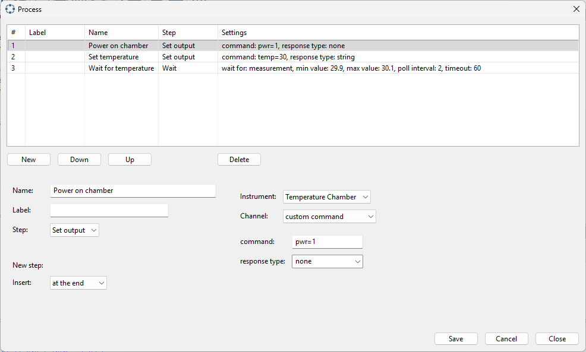

Custom commands
---------------

All drivers are automatically provided with a channel for using custom commands.
This is usefull when you whish to try a command from the instrument that is not
implemented in the driver. This can be used in measurements and process steps.

Custom command in a measurement:

|

Custom command in a process step:

|

When selecting a channel, select `custom command`. Two fields are visible:

* command: a text box where you can enter the command.
* response type: a drop down to select the response type. If no response is expected, select `none`.

Note that there is no `value` field. The value must be included in the command field.
