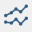
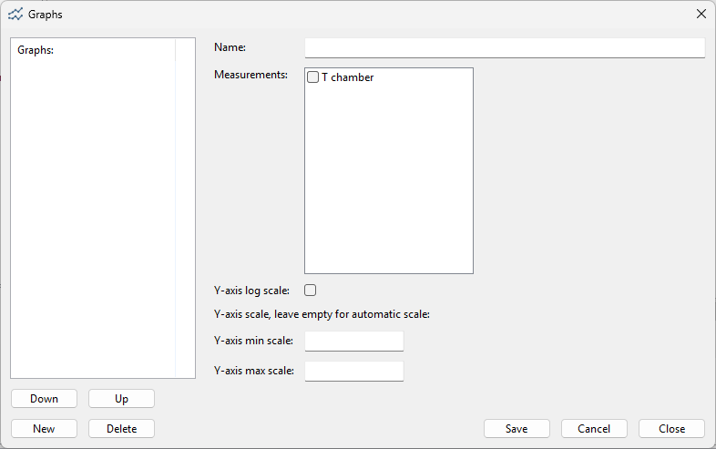
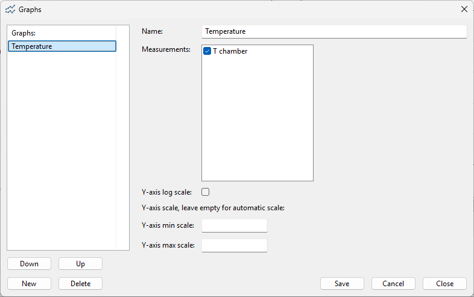
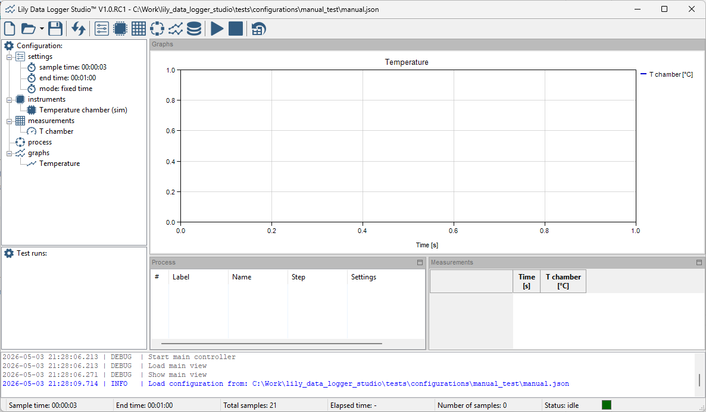
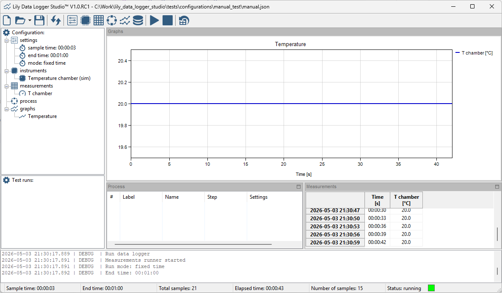

Graphs
------

Measurements can be added to graphs. For managing the instruments, click the following toolbar button:

The following dialog appears:

|

You can create multiple graphs and in each graph you can add multiple measurements. That way you can
group similar measurement in one graph. An group multiple measurements over multiple graphs.
A maximum of 12 graphs are supported in the application.
Graphs are automatically arranged in row and colums. With the up and down buttons the order of the
graphs can be changed.

You can simple add a graph by enter a name and check one or more measurements:

|

The graph name must be unique. There are a few settings for the graph. They have influence on the
Y axis scaling.

When adding multiple measurements in one graph, they all use the same Y axis scale.
Make sure that those measurements are in the same range to have a proper graph.
If the range is not matching, seperate graphs should be created.

Once the graph is saved, they will show in the list.
The graph settings can be updated by double clicking the graph in the list.

The graphs are automatically shown in the main window:

|

When the graphs is empty and no scaling options are set, the application chooses default scale options.
Those will be updated once the measurements are running:

|

The time scale starts in seconds. When too many seconds passed, the time scale will changed
automatically to minutes. After too many minutes, the time scale will change automatically to hours.
It will continue in hours until the data logger is finished.
