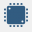
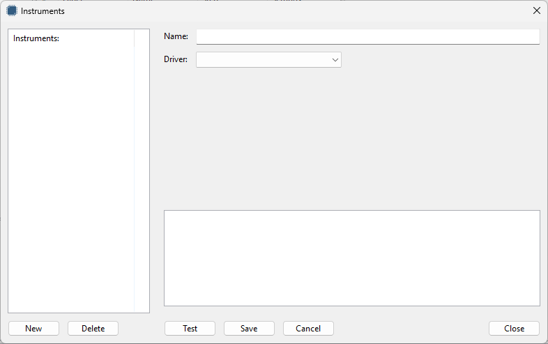
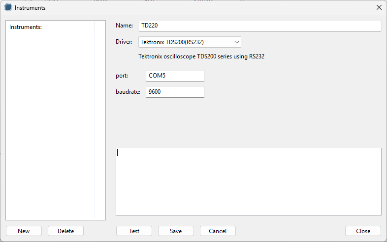
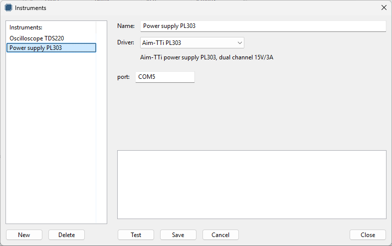

Instruments
-----------

Instruments represent your physical instrument.
For managing the instruments, click the following toolbar button:

The following dialog appears:

|

To add an instrument, enter a name for the instrument, select a driver and enter the driver settings.
Instrument names must be unique. Below is a screenshot for adding the Tektronix TDS220 oscilloscope:

|

The settings like port and baudrate depends on which settings are exposed by the driver.
If settings are not exposed, default settings are used.

If there is no driver for your instrument, you can create one.
A separate manual for developing drivers is available.

Before saving you can test the settings by clicking the Test button.
This will run a test provided by the driver to check if the instrument responds correct.
Information about the test results will be shown in the text box.

Once the instrument is saved, they will show in the list.
The instrument settings can be updated by double clicking the instrument in the list.

|

When the Cancel button is pressed all changes are reverted.

Instruments can only be deleted when they are not used in process steps or measurments.
