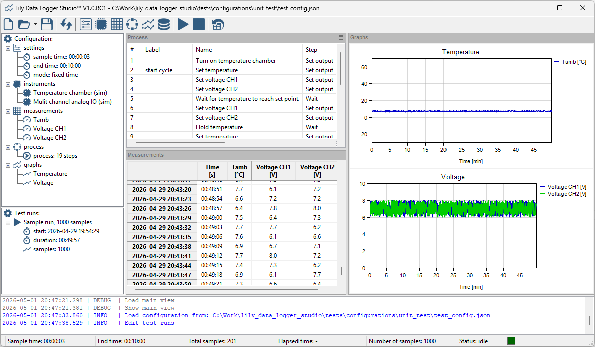

Main window
-----------

Below is a screenshot of the main window:

.. image:: images/main_window.png
   :align: center

|

The main window has the following parts:

* Toolbar: this contains all the buttons for controlling the application.
* Configuration: a treeview on the left side visualizing the contents of the configuration.
* Test runs: a tree view on the left side visualizing the available test runs.
* Log window: a window at the bottom contain all log messages.
* Graphs panel: a panel containing the graphs.
* Process panel: a panel containing the process control steps.
* Measurements panel: a panel containing a table with the measurements.

The left side can be resized by dragging the border between the tree views and the panels.
The log window can be resized by dragging the border between the log window and the panels.

The panels can be rearranged by moving the process panel and or the measurements panel.
The graphs panel cannot be moved.
All panels can be resized by dragging the borders between the panels.
Below is a screenshot of an example of a custom layout:

|

The default layout can be restored with the following toolbar button:

All changes in the main window are saved to the application settings file.
