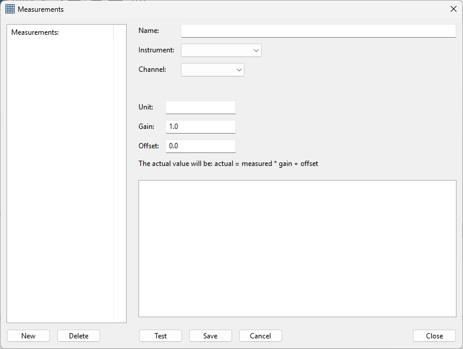
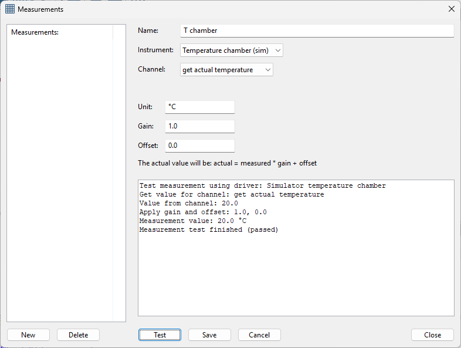
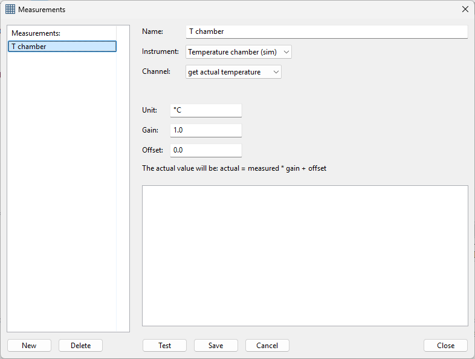
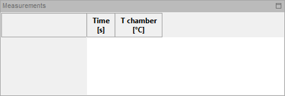

Measurements
------------

Measurements can only be created if there are instruments.
Measurements can be used in process steps, graphs and are added to the measurements table.
For managing the measurements, click the following toolbar button:

The following dialog appears:

|

To add a measurement enter a name for the measurment. measurement names must be unique.
Next select an instrument and the channel for the measurement. Some channels may require
extra parameters. Below is a screenshot for adding a temperature measurement using the
temperature chamber simulator.

|

There are two extra settings for a measurement 'gain' and 'offset'. With these settings, you can
adjust the measured value from the instrument. The actual value will be:

actual = measured * gain + offset.

With this measurement values can be adjusted. This can be usefull for converting readings from
sensors to an actual value. For example when reading an analog temperature sensor using a voltmeter.
The read voltage must then be converted to the actual temperature in degrees Celcius.

Before saving you can test the settings by clicking the Test button. The applications will try to
connect to the instrument and execute the measurement. The resutl will be shown in the text box.

Once the measurement is saved, they will show in the list.
The measurement can be updated by double clicking the measurment in the list.

|

When the Cancel button is pressed all changes are reverted.

Measurements can only be deleted when they are not used in process steps or measurments.

Measurements are automatically added to the measurements table:

|

After each edit the table is automatically updated. The table is cleared when updating the
measurements table. This may result in loss of any measurement data that was present in the
table.
