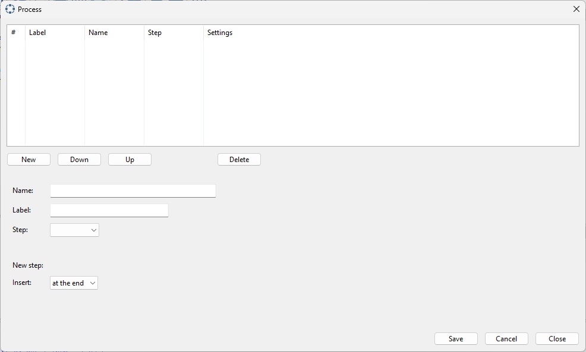
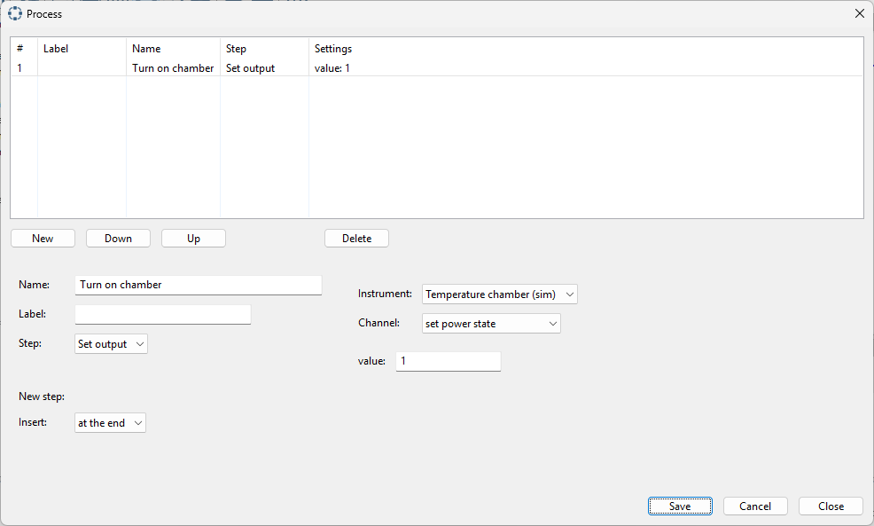
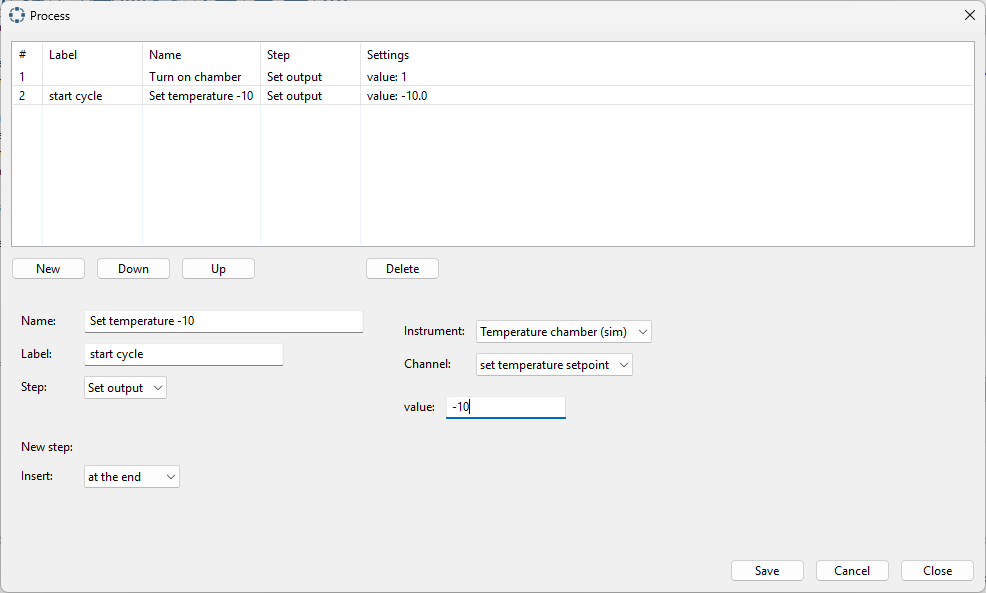
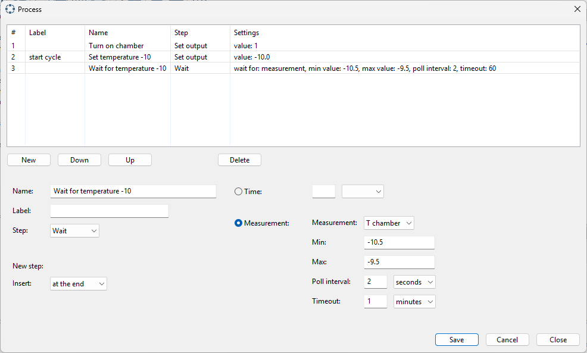
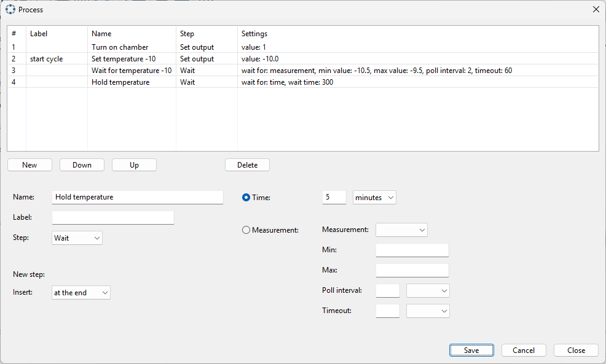
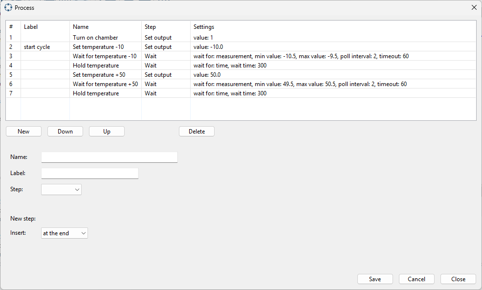
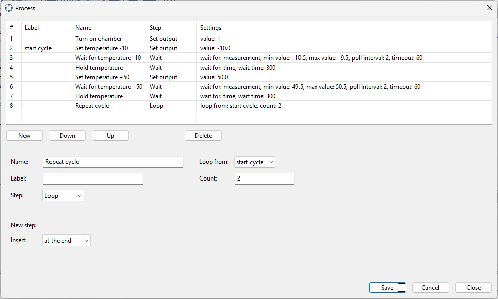
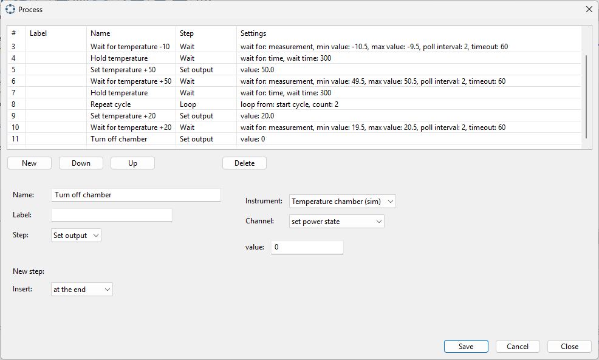
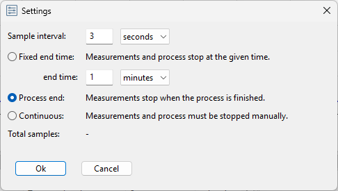
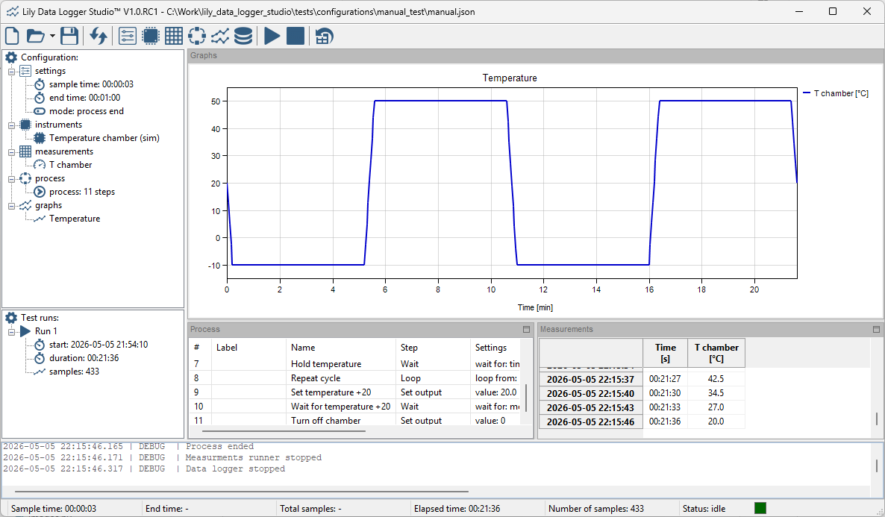

Process control
---------------

With a process you can control instruments. A process can use instruments and measurements.
For managing the process, click the following toolbar button:

The following dialog appears:

|

A process consists of steps. You can choose from the following steps:

* set output: set a value in an instument.
* wait: wait for a certain time, or wait until a measurement reached a certain value.
* loop: repeat certain steps a number of times. Loops can be nested.

In this example we will use the temperature chamber simulator to create a temperature cycle.
Make sure you have a configuration with the instruments and measurements as described in
the chapters 'Instruments' and 'Measurments'.

The process we create is as follows:

* Turn on the temperature chamber.
* Set the temperature to -10.
* Wait for the temperature to reach -10.
* Stay on that temperature for a certain time.
* Set the temperature to +50.
* Wait for the temperature to reach +50.
* Stay on that temperature for a certain time.
* Repeat the cycle.
* After repeat, set the temperature to +20.
* Wait for the temperature to reach +20.
* Turn off the temperature chamber.

When entering steps, a step must have a name. The name does not have to be unique.
A step can also have a label. This label is used for the loop step. The label must be unique.

The first step is turning on the temperature chamber. This is a set output step:

|

Enter the name and select the set output step. Once the step is selected, you can select the
instrument and the channel. As value enter 1 (1 = on, 0 = off).

The next step is setting the temperature to -10. This is also a set output step:

|

We also set a label for this step. When we want to repeat the cycle, we repeat from this step.
As channel we select to set the temperature set point with value -10 (degrees Celcius).

The next step is waiting for the temperature to reach -10. This is a wait step:

|

The wait step has two options. Wait for a fixed time or wait for a measurement to reach a certain value.
The wait step finishes when the measurment value is within the min and max value.
If the measurement is not reached, the step is aborted after the given timeout.
The process continuous with the next step.

The next step is hold the temperature at -10 for a certain time:

|

This is a wait step with a fixed time of 5 minutes.

This is the first part of the cycle. In the second part we bring the temperature to +50.
The steps are similar except for the temperature values.
To complete the cycle add the following steps:

* step 5: set temperature to +50. This is a set output step similar to step 2.
* step 6: wait for temperature to reach +50. This is a wait step similat to step 3.
* step 7: hold temperature at +50. This is a wait step similat to step 4.

The process should now looks similar to this:

|

Now we want to repeat the cycles. We add a loop step:

|

We loop from the step with label 'cycle start'.
We set the counter to 2, meaning the cycle runs 2 times (repeated 1 time).

Finally we add three steps to return the temperature to +20 and turn of the temperature chamber.

* step 9: set temperature to +20. This is a set output step similar to step 2.
* step 10: wait for temperature to reach +20. This is a wait step similat to step 3.
* step 11: turn off the chamber. This is similar to step 1. Use value 0 to turn off the chamber.

The complete process looks like this:

|

Before running the process we need to update the configuration settings.
The configuration is set to a fixed end time of 1 minute. This is too short to complete the process.
We will set the mode to process end.

|

Now everything is set and the process can be started. Press the start button to start the process.
The process takes about 22 minutes. The result should look like this:

|
