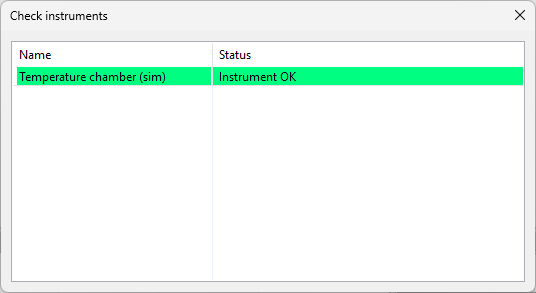
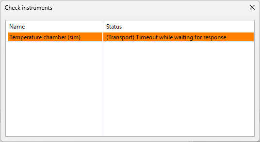
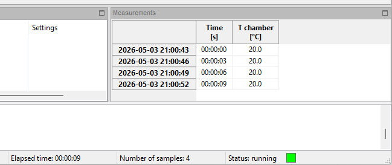

Run the data logger
-------------------

Now we have a measurement we can run the data logger. For running and stopping the data logger,
the following toolbar buttons can be used:

Press the play button to start the measurements.

Before the actual measurements start, the instrumenst are checked if they are connected properly.
A dialog will appear showing the reasult of the check:

|

When all instruments pass, the dialog closes and the measurements will start.
In case of one or more failures, the dialog stays open for inspection:

|

After closing the dialog, the measurements will not be started not started.
Using the edit instruments dialog, you can try to solve issues for specific instruments by
changing settings and using the 'Test' button for testing the new settings to see if the
issue is solved.

When the data logger is running, the measurements table and graphs (if any) are updated when
new data is available. Also in the status bar at the bottom, the elapsed time, number of samples
and status is updated:

|

In this case the tempertature is constant. This is because the temperature chamber is switched off.
Later when we create a process, we will turn on the temperature chamber and run a
temperature cycle (simulated).
