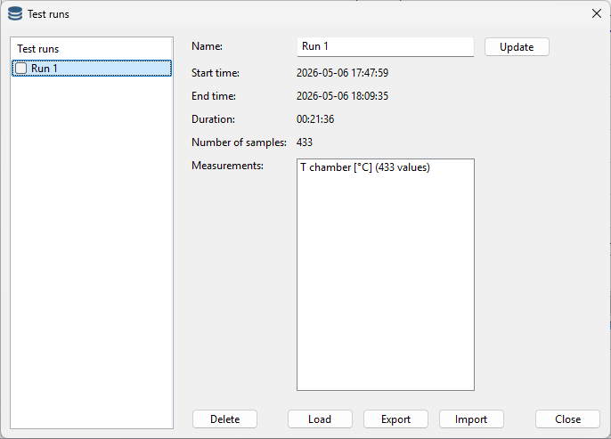

Test runs
---------

All test run data is stored in memory and can be accessed by the test run manager.

For managing the process, click the following toolbar button:

The following dialog appears:

|

From this dialog, test runs cam be renamed, deleted, exported, imported, or loaded in the main window.

To rename a test run, double click on a test run in the list to load the properties.
Simply change the name in the text box and click the update button.

To load a test run in the main window, select the test run in the list (not check)
and click the load button. The test run will only load if the data is matching with the
configuration settings (measurements). If nothing is loaded, the test run does not match with
the configuration.

To export one or more test runs, check on or more test runs and click the export button.
The following export options are avaiable:

* SQLite: all checked test runs are exported to a single file SQL database.
* JSON: all checked test runs are exported to a single file JSON file.
* CSV/TSV: each checked test run is exported to it's own file. CSV is comma separated and
  TSV is tab separated.

All file formats can be processed with programming languages, free tools or spreadsheets.

SQLite and JSON export all information about the test runs.
CSV and TSV do not export all information and information can be lost.

Import is only possible from SQLite and JSON, because all information required for import
is avaiable in those formats.

To delete a test run, select a test run in the list (not check), and click the delete button.
