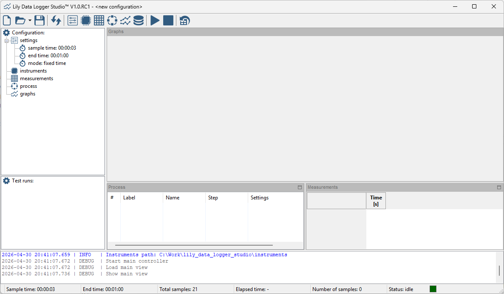
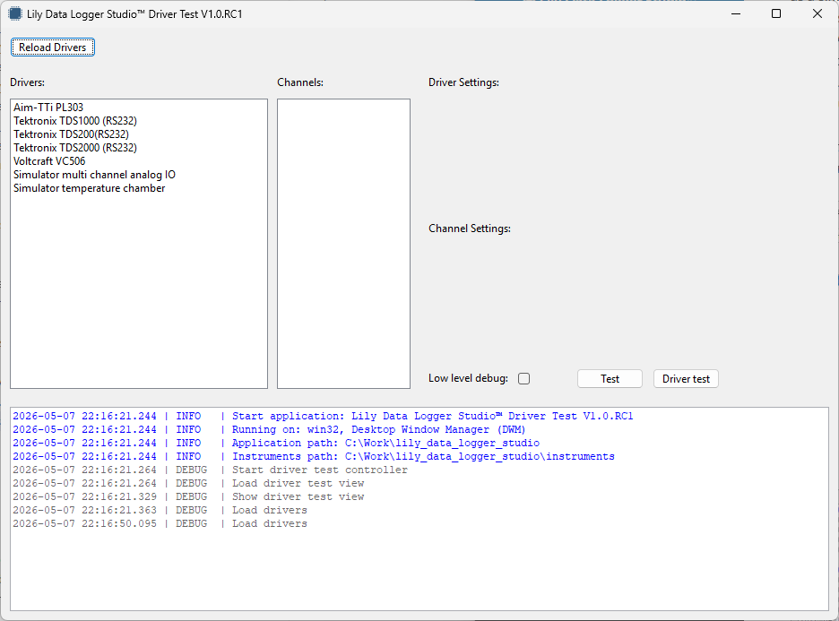

# Lily Data Logger Studio

Universal data logger and process control software.

Log data from electronic instruments and control electronics instruments.
* Log measurements from electronic instruments (voltage, current, temperature, etc.).
* Control electronic instruments (temperature chambers, power supplies, signal generators, etc.).
* Output to table, graph and CSV file.
* Write your own drivers using Python for any instrument. Templates and a VS Code workspace are included.
* Tested on Windows and Ubuntu (probably can run on others).

## Road map

Release 1.0:
* Read and save configuration files. ✅
* Change configuration settings. ✅
* Load and reload drivers from the instruments package. ✅
* Edit instruments in the configuration. ✅
* Edit measurements. ✅
* Start/stop data logger, runs measurements and process steps. ✅
* Edit process steps for controlling instruments. ✅
* Edit graphs in the configuration. ✅
* Show measurements in the data table  ✅
* Show measurements in graphs. ✅
* Show live updates of the process. ✅
* Application for testing created drivers. ✅
* Templates and a VS code workspace included for creating drivers. ✅
* Manage test runs (show, delete, export)
* User manual for data logger and for creating drivers.

Issues or feature requests can be submitted in the issue tracker: https://github.com/LilyTronics/lily_data_logger_studio/issues

## Contributing

If you find the Lily Data Logger Studio usefull and want to support it you can support in the following ways:
* Sponsor us, so we can spend more time on maintaining this software (https://github.com/sponsors/LilyTronics)
* Write instrument drivers. With more drivers the software becomes more usefull.
* If you cannot write instrument drivers yourself, we can do it for you.
  * We need access to the instrument (remote connection to a PC that is connected with the instrument).
  * You can send the instrument to us for borrowing and we can create a driver, then we send it back.
* Promote this software using your social channels.

## Installation

Download the zip file from the releases. This contains the compiled executable, libraries and instruments
package. It is a portable applicationa and doesn't require any installation.
Just extract the zip file into a folder and run the executable.
Two manuals are included in PDF format. One about using the application and
one about adding instruments to the instruments package.

## Instruments package

The application uses a separate instruments package containing all Python code for communicating with
the instruments. This package can be updated seperately from the application.
This way any instrument can be integrated with the application even after installing the application.
Templates and a VS code workspace are included for creating drivers.
A test application is included for testing the drivers.

---

© LilyTronics by Danny van der Pol

This software is provided as is. LilyTronics does not accept any liabilites for damages that may be
caused by this software.
